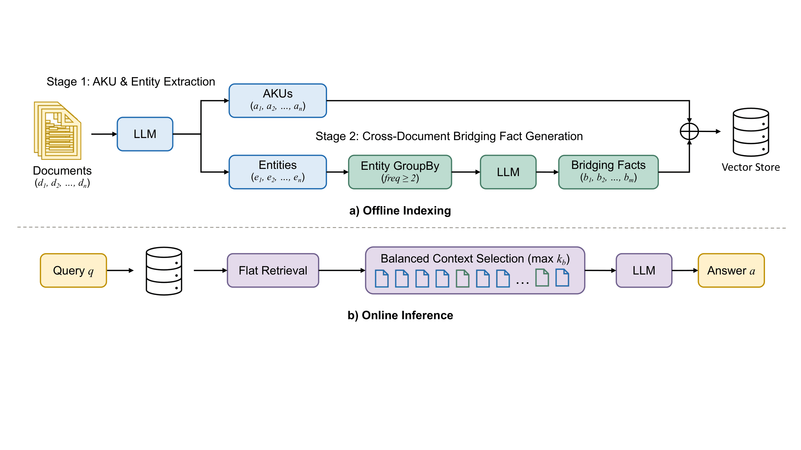

<div align="center">

# IndexRAG

_Index-Time Reasoning for Multi-Hop Retrieval-Augmented Generation_

AACL-IJCNLP 2026, Findings

[](https://arxiv.org/abs/2603.16415)
[](LICENSE)
[](https://python.org)
[](https://github.com/facebookresearch/faiss)

</div>

<p align="center">
  
</p>

## 🎯 Overview

**IndexRAG** shifts cross-document reasoning from online inference to offline
indexing. Graph-based and iterative RAG systems answer multi-hop questions by
doing extra work at query time — entity extraction, graph traversal, or several
rounds of retrieval and generation. IndexRAG does that work once, while
building the index, and stores the result as **bridging facts**: independently
retrievable units that already encode a cross-document connection.

At query time nothing special happens. One retrieval pass over a flat vector
index, one LLM call, done.

The repository covers:

- **Two offline stages**: atomic knowledge unit (AKU) extraction, then
  cross-document bridging fact generation
- **3 multi-hop QA benchmarks**: HotpotQA, 2WikiMultiHopQA, MuSiQue
- **4 index variants**: IndexRAG, AKU-only, Naive RAG chunks, graph-based
- **3 retrieval backends**: dense, BM25 with reciprocal rank fusion, graph
  traversal
- **Training-free**: no fine-tuning of the embedding model or the LLM

<p align="center">
    🔨&nbsp;<a href="#-installation">Installation</a>
    | 🚀&nbsp;<a href="#-quick-start">Quick Start</a>
    | ✨&nbsp;<a href="#-key-results">Results</a>
    | 📁&nbsp;<a href="#-project-structure">Structure</a>
    | 🔗&nbsp;<a href="#-citation">Citation</a>
</p>

## 🔗 Citation

```bibtex
@article{bao2026indexrag,
  title   = {IndexRAG: Bridging Facts for Cross-Document Reasoning at Index Time},
  author  = {Bao, Zhenghua and Shi, Yi},
  journal = {arXiv preprint arXiv:2603.16415},
  year    = {2026}
}
```

The Findings version is forthcoming. This entry will be replaced by the ACL
Anthology one once it is available.

## ✨ Key Results

F1 on 1,000 sampled questions per benchmark. All methods below use **a single
retrieval pass and a single LLM call** at inference time.

| Method | HotpotQA | 2WikiMultiHopQA | MuSiQue | Avg |
|--------|:--------:|:---------------:|:-------:|:---:|
| BM25 | 60.3 | 35.9 | 19.2 | 38.5 |
| Naive RAG | 63.6 | 47.7 | 29.9 | 47.1 |
| RAPTOR | 63.6 | 47.8 | 29.7 | 47.0 |
| FastGraphRAG | 63.5 | **57.4** | 27.2 | 49.4 |
| **IndexRAG** | **68.9** | 51.7 | **34.4** | **51.7** |

IndexRAG gains **+4.6 F1** over Naive RAG on average without adding an online
LLM call.

Methods that spend more at query time are a separate class. HippoRAG2 reaches
54.1 avg F1 using two LLM calls and graph traversal. Bridging facts compose
with those methods rather than competing with them: adding them to IRCoT
reaches **55.0 avg F1**.

The saving is on the online side. Against HippoRAG2, retrieval is
**6.6–10.4× faster**, on an index **17–20× smaller** and **30–50% cheaper** to
build.

## 🔨 Installation

### Prerequisites

- Python 3.9 or newer
- An OpenAI API key (used for extraction, bridging, embeddings and answering)

### Setup

```bash
git clone https://github.com/Continuum-AI-Corp/IndexRAG.git
cd IndexRAG

pip install -e .                    # core
pip install -e ".[benchmarks]"      # + dataset download tools
pip install -e ".[graph]"           # + graph-based baseline
```

Copy the example environment file and fill in your key:

```bash
cp .env.example .env
# or simply
export OPENAI_API_KEY=sk-...
```

### OrcaRouter embeddings: API key or PKCE login

OrcaRouter can provide embeddings for IndexRAG stores, Naive RAG stores and
semantic/hybrid retrieval. Choose either authentication method:

```bash
# Option 1: use your existing API key
export ORCAROUTER_API_KEY=sk-orca-...

# Option 2: sign in with your OrcaRouter account using OAuth + PKCE
indexrag-auth login
# To open the displayed URL yourself on the same machine:
indexrag-auth login --no-browser
```

The login command opens the OrcaRouter consent page and listens on a random
port bound to `127.0.0.1`. Approve IndexRAG; the browser redirects back automatically.
After the key is saved, the callback page attempts to close its tab automatically;
if the browser blocks this, it displays a manual-close message.
The callback verifies the per-login state before exchanging the code using S256
PKCE, without a client secret. Open the browser on the same machine as the CLI
(or arrange an SSH forward for the displayed callback port). This avoids the
unsupported `callback_url=oob` flow. Login expires after ten minutes; a failed/canceled login leaves
your previous credentials unchanged. The resulting key is stored locally at
`$XDG_CONFIG_HOME/indexrag/orcarouter.json` (default
`~/.config/indexrag/orcarouter.json`) with owner-only file permissions. This is
local credential storage, not an encrypted system keychain. An explicit
`ORCAROUTER_API_KEY` takes precedence over the saved login.

Enable the provider in every indexing and query process:

```bash
export INDEXRAG_EMBEDDING_PROVIDER=orcarouter
# Optional; this is the OrcaRouter default embedding model:
export INDEXRAG_EMBEDDING_MODEL=openai/text-embedding-3-small

# Embedding-only example: build a Naive RAG store from .txt documents
python -m scripts.build_kb --data-dir path/to/documents --kb-type naive
```

```python
from indexrag.retrieval import SemanticSearch

search = SemanticSearch(embedding_provider="orcarouter")
search.load_vector_store("vector_store/conventional_vector")
for document, distance in search.search("What connects these documents?", top_k=3):
    print(document.page_content, distance)
```

Oversized OrcaRouter inputs are split into Unicode-safe raw-text chunks (up to
8,000 UTF-8 bytes for OpenAI models, 2,000 for other model IDs). Chunk vectors
are averaged using UTF-8 byte lengths as weights, then normalized to produce
one vector per original document or query. Short-input vectors are normalized
as well, so FAISS compares long and short inputs on the same scale. Rebuild
indexes created with earlier versions of this integration if your embedding
model returns non-unit vectors. Requests contain at most 32 chunks to bound
aggregate request size;
both synchronous and asynchronous embedding methods use this behavior.

Use the same provider and embedding model when building and loading an index.
Rebuild existing indexes when changing embedding models; equal vector dimensions
do not imply compatible embedding spaces. The `embedding_provider` and
`embedding_model` keyword arguments also work with `build_indexrag_store` and
`build_naive_store`. Existing calls default to OpenAI.

`indexrag-auth status` reports whether credentials are configured without
printing them. `indexrag-auth logout` removes the local login; revoke the key in
your OrcaRouter console to invalidate it remotely. Environment keys are not
removed by logout. Starting another login or running logout invalidates older
pending login attempts. A cross-process lock protects the generation check and
credential replacement, so a delayed callback cannot restore a logged-out key
or overwrite a more recent login.

The defaults are `https://api.orcarouter.ai/v1` for embeddings and
`https://www.orcarouter.ai` for authorization. Override them independently with
`ORCA_API_BASE_URL` and `ORCA_AUTH_BASE_URL`, or use `ORCA_BASE_URL` as a shared
fallback. Saved keys are bound to the API URL used at login; changing that URL
requires a new login or an explicitly configured key.

This setting changes embeddings only. AKU extraction, bridging generation and
answering continue to use their existing OpenAI configuration; the embedding-only
Naive RAG example above does not require an OpenAI key. The optional GraphRAG
backend keeps its own provider configuration. `.env` is an example configuration
file; export variables into the shell (the scripts do not automatically load it).

## 🚀 Quick Start

The shortest path from a folder of documents to an answer:

```bash
python -m examples.quickstart --data-dir path/to/documents
```

The full pipeline is four offline steps and one query step.

### 1. Prepare a dataset

HotpotQA and 2WikiMultiHopQA download automatically. MuSiQue must be fetched
manually from [its repository](https://github.com/StonyBrookNLP/musique).

```bash
python -m benchmarks.prepare_hotpotqa --output dataset/hotpotqa_1000_hf --max-queries 1000
python -m benchmarks.prepare_2wiki    --output dataset/2wikimultihopqa_1000 --max-queries 1000
python -m benchmarks.prepare_musique  --input path/to/musique_ans_v1.0_dev.jsonl \
                                      --output dataset/musique_1000
```

### 2. Extract AKUs (Stage 1)

```bash
python -m scripts.extract_akus --data-dir dataset/hotpotqa_1000_hf/documents
```

Writes a cache of atomic question-answer pairs and their entities, one entry
per document.

### 3. Generate bridging facts (Stage 2)

```bash
python -m scripts.generate_bridging --cache cache/hotpotqa_1000_hf_faqs.json
```

Entities appearing in two or more documents become bridge entities. Each one
yields bridging facts that connect its source documents.

### 4. Build the index

```bash
# IndexRAG: AKUs and bridging facts in one flat store
python -m scripts.build_kb \
    --data-dir dataset/hotpotqa_1000_hf/documents \
    --kb-type indexrag \
    --cache cache/hotpotqa_1000_hf_faqs.json \
    --bridging cache/hotpotqa_1000_hf_faqs_bridging.json

# Naive RAG baseline
python -m scripts.build_kb --data-dir dataset/hotpotqa_1000_hf/documents --kb-type naive

# Graph baseline
python -m scripts.build_kb --data-dir dataset/hotpotqa_1000_hf/documents \
    --kb-type graph --cache cache/hotpotqa_1000_hf_faqs.json
```

### 5. Evaluate

```bash
python -m benchmarks.evaluate --dataset hotpotqa_1000_hf --kb-type indexrag --top-k 20 --context-docs 10
python -m benchmarks.evaluate --dataset hotpotqa_1000_hf --kb-type naive --top-k 10
python -m benchmarks.evaluate --dataset hotpotqa_1000_hf --kb-type graph
```

## 📁 Project Structure

```
indexrag/
    preprocessing/        document loading, fixed-size chunking
    aku/                  Stage 1: AKU extraction, schema, prompts
    bridging_facts/       Stage 2: entity linking, bridging fact generation
    indexing/             index construction for each variant
    retrieval/            dense, BM25 with RRF, graph traversal

scripts/                  offline pipeline entry points
benchmarks/               dataset preparation, metrics, evaluation driver
examples/                 quickstart and a custom Stage 1 strategy
```

## ⚙️ Configuration

Settings behind the reported results. Retrieval depth is passed explicitly, as in
the benchmark commands above:

| | Value |
|---|---|
| LLM (all stages) | `gpt-4o-mini` |
| Embeddings | `text-embedding-3-small` |
| Vector store | FAISS, flat index |
| Retrieval | top 20 by cosine similarity, 10 passed to the LLM |
| Bridge entity document frequency | 2 to 10 |
| Source documents per bridge entity | at most 5 |
| Facts per source document | at most 8 |
| Passage chunking (baselines) | about 100 words, 80 character overlap |

Prompt templates live next to the code that uses them, under
`indexrag/aku/prompts/`, and are kept verbatim so results stay reproducible.

## 📄 License

Apache-2.0. See [LICENSE](LICENSE).

Benchmark datasets keep their original licences. HotpotQA and MuSiQue are
CC BY-SA 4.0, 2WikiMultiHopQA is Apache-2.0. FAISS is MIT.

## 🙏 Contact

Questions and bug reports are best filed as
[issues](https://github.com/Continuum-AI-Corp/IndexRAG/issues).
For anything else, `research@orcarouter.ai`.
